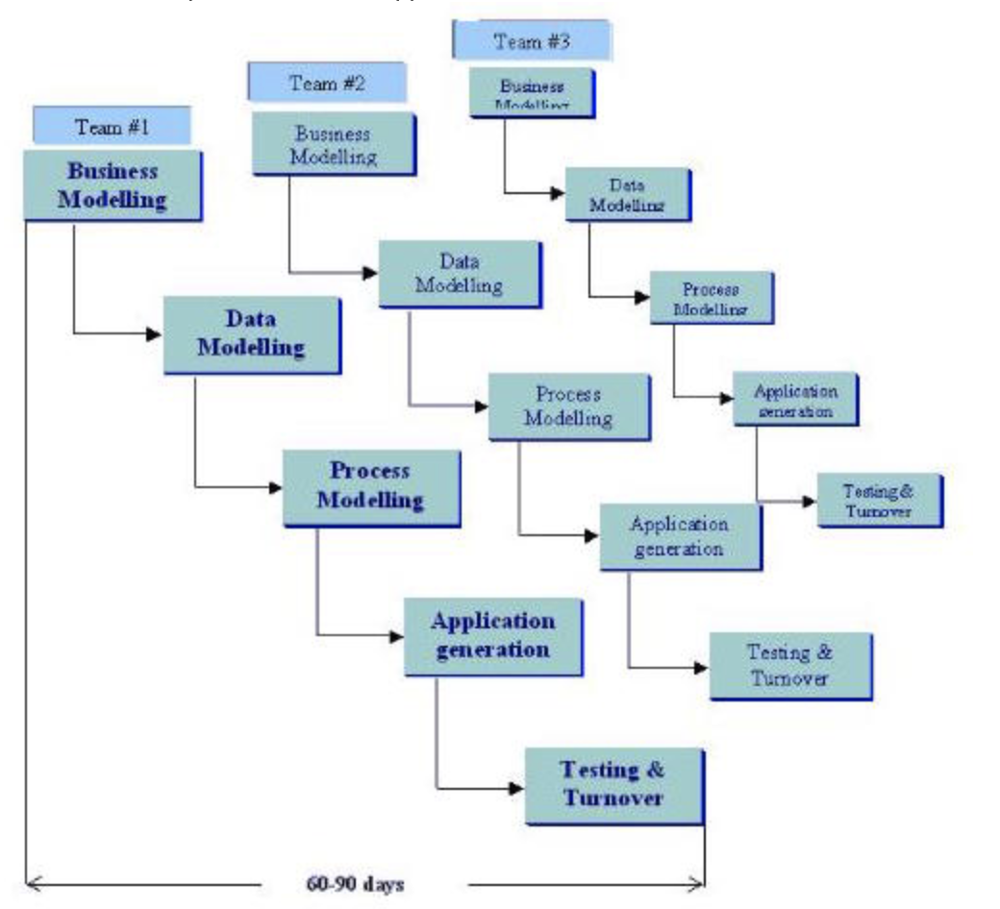
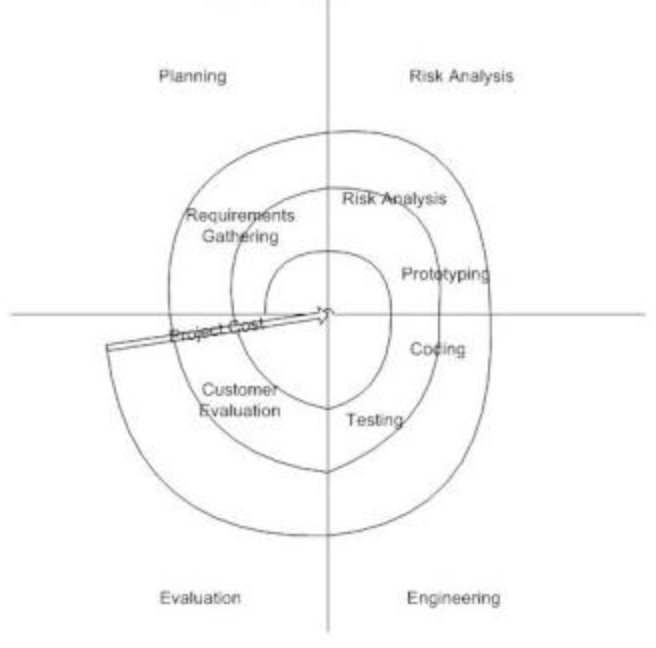
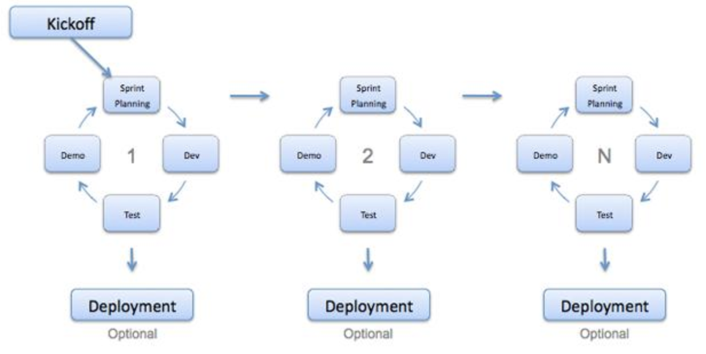
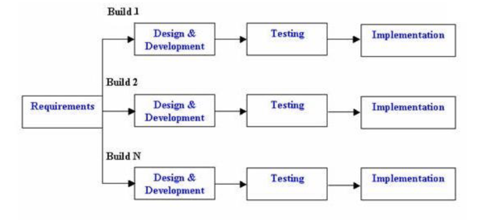
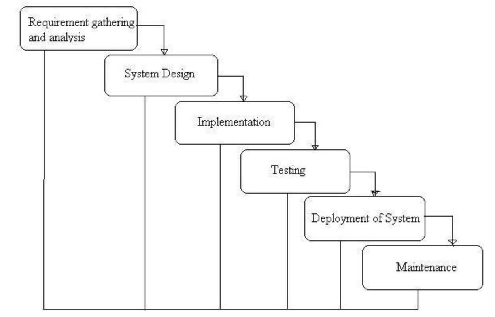
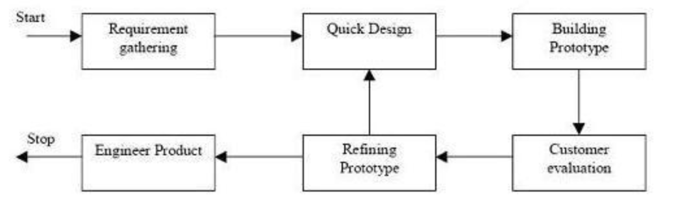

# Analysis and design part 1 test answers


## Question 1
This diagram shows the phases and iteration of a software development model or approach. Which software development model or approach is shown?



```
- RAD
```

## Question 2
This diagram shows the phases and iteration of a software development model or approach. Which software development model or approach is shown?



```
- Spiral
```
## Question 3
This diagram shows the phases and iteration of a software development model or approach. Which software development model or approach is shown?



```
- Agile
```
## Question 4
This diagram shows the phases and iteration of a software development model or approach. Which software development model or approach is shown?



```
- Incremental
```
## Question 5
This diagram shows the phases and iteration of a software development model or approach. Which software development model or approach is shown?



```
- Waterfall
```
## Question 6
This diagram shows the phases and iteration of a software development model or approach. Which software development model or approach is shown?



```
- Prototyping
```

## Question 7
Which of the following are *advantages* of the Waterfall method?
```
- Works well for smaller projects where requirements are very well understood.

- In this model phases are processed and completed one at a time.

- Phases do not overlap.

- It is easy to manage due to the rigidity of the model – each phase has specific deliverables and a review process.
```
## Question 8
Which of the following are *disadvantages* of the Spiral method

```
- Can be a costly model to use.

- Project’s success is highly dependent on the risk analysis phase.

- Risk analysis requires highly specific expertise.

- Doesn’t work well for smaller projects.
```

## Question 9
Which of the following are *advantages* of an agile approach

```
- Working software is delivered frequently (weeks rather than months).

- Close, daily cooperation between business people and developers.

- Regular adaptation to changing circumstances.

- Even late changes in requirements are welcomed,
```

## Question 10
Which of the following are disadvantages of the Prototype method?

```
- Leads to implementing and then repairing way of building systems.

- Practically, this methodology may increase the complexity of the system as scope of the system may expand beyond original plans.

- Incomplete application may cause program not to be used as the full system was designed

- Incomplete or inadequate problem analysis.,
```

## Question 11
Which of the following are advantages of the Incremental method?

```
- Generates working software quickly and early during the software life cycle.

- This model is more flexible – less costly to change scope and requirements.

- It is easier to test and debug during a smaller iteration.

- In this model customer can respond to each build.
```

## Question 12
Which of the following are disadvantages of the Rapid Application Development method?

```
- Depends on strong team and individual performances for identifying business requirements.

- Only system that can be modularised can be built

- Requires highly skilled developers/designers

- Inapplicable to cheaper projects as cost of modelling and automated code generation is very high.
```

## Question 13
Match the agile tools to their descriptions

| Tool        | Description |
| ------------- |:-------------:|
| Daily Scrum stand-up     | A meeting in which each member lists their achievements from the previous day, their planned work today and any impediments |
| Product roadmap    | A plan that matches short-term and long-term business goals with specific technology solutions to help meet those goals     |  
| User stories| A tool used to capture a description of a software feature from an end-user perspective.   |
| Product Backlog| A prioritised features list, containing short descriptions of all functionality desired in the product.     |

## Question 14

Which of these are functional requirements?

```
- Business Rules

- Authorisation levels

- External Interfaces

- Transaction corrections, adjustments and cancellations
```

## Question 15

Which of these are non-functional requirements?

```
- Recoverability

- Capacity

- Serviceability

- Interoperability

- Legal or Regulatory Requirements

```
