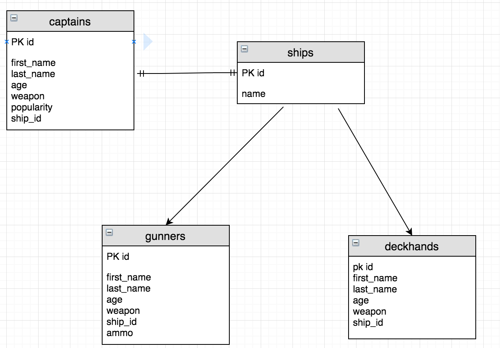
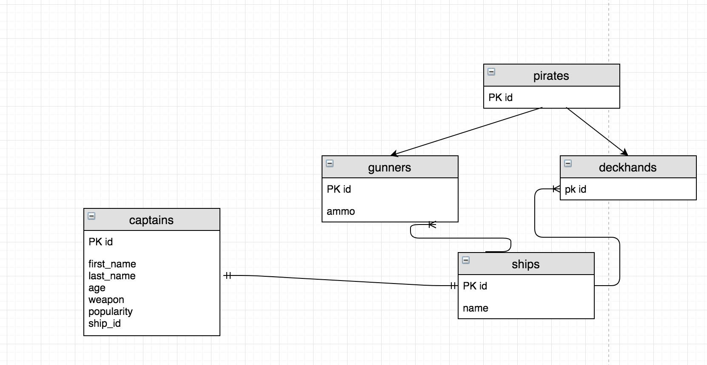
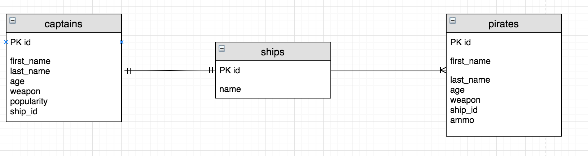
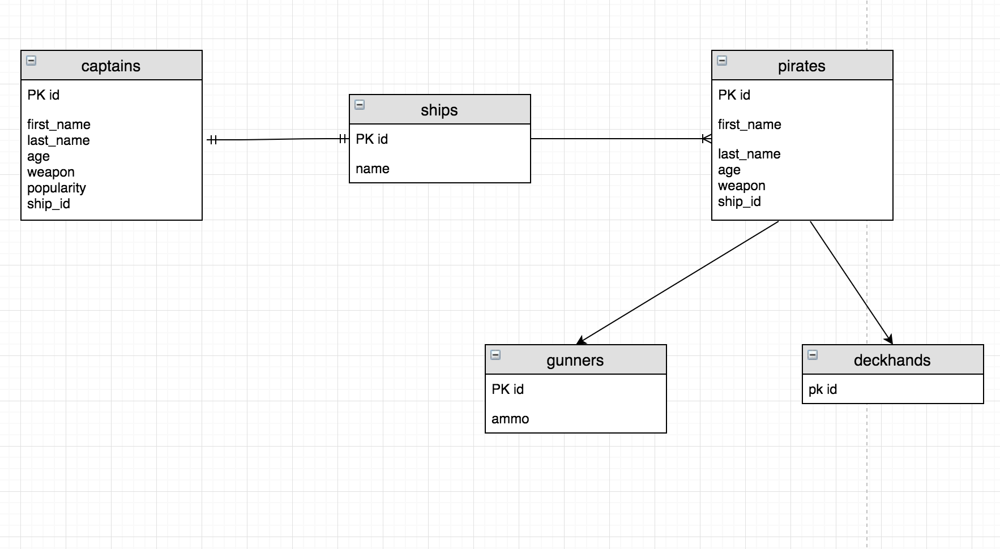

# Inheritance with Hibernate

## Learning Objectives

- Understand the 4 ways to implement inheritance with hibernate.
- Know how to map abstract classes.
- Know how to map inheritance chains using the joined strategy

## Inheritance with Hibernate

As we know Inheritance is one of the 4 pillars of OO Programming.

This could cause us problems if we were trying to persist superclasses and sub-classes to a relational database as SQL alone doesn't really support this.

Lucky for us we are using Hibernate!

Hibernate has a number of ways of dealing with inheritance which we will cover here. There are 4 main ways to map an inheritance hierarchy.

Each of which have advantages and disadvantages. It’s, therefore, important to understand how they differ and to choose the one that is most suitable to your application.

> Hand out start point and have students open

In the start code the pirate system has been amended.

We have 2 new classes for `DeckHand` and `Gunner`.

So let's start using inheritance.

We will mark our `Pirate` class as an abstract class and have
`DeckHand` and `Gunner` extend it.

```Java
// Pirate.Java
@Entity
@Table(name="pirates")
public abstract class Pirate { // MODIFIED

  private int id;
  private String firstName;
  private String lastName;
  private int age;
  private Weapon weapon;
  private Ship ship;
  private List<Raid> raids;


}
```

> Note we will not have Captain inherit as this has different relationship type for `Ship` and won't go on raids.

In  `DeckHand` and `Gunner` we will make these extend `Pirate` and we will create our constructor.

We will also mark these as entities to be mapped to the database.

`Gunner` has an extra property for `Ammo` and method to fire cannon so we will mark this as a property we want to map to the database.


```java
// Gunner.Java
@Entity
@Table(name= "gunners")
public class Gunner extends Pirate { // MODIFIED

  private int ammo;

  public Gunner() {
  }

  public Gunner(String firstName, String lastName, int age, Weapon weapon, Ship ship, int ammo) {
    super(firstName, lastName, age, weapon, ship); // ADDED
    this.ammo = ammo;
  }

  @Column(name = "ammo")
  public int getAmmo() {
    return ammo;
  }

  public void setAmmo(int ammo) {
    this.ammo = ammo;
  }


  public void fireCannon(){
    this.ammo = this.ammo -1;
  }

}
```

```java
// DeckHand.Java
package models;

import javax.persistence.Entity;
import javax.persistence.Table;

@Entity
@Table(name = "deckhands")
public class DeckHand extends Pirate {

  public DeckHand() {
  }

  public DeckHand(String firstName, String lastName, int age, Weapon weapon, Ship ship) {
    super(firstName, lastName, age, weapon, ship); // ADDED
  }
}
```

And the last thing we will need to do is to add these mappings to our configuration file.

```xml

<!-- hibernate.cfg.xml -->
<mapping class = "models.Raid"/>
<mapping class = "models.DeckHand"/> // ADDED
<mapping class = "models.Gunner"/> // ADDED
```

Notice that all the properties and mappings that are common to all pirates are now mapped in the abstract class.

This is because hibernate will handle mapping the appropriate properties to the classes that extend `Pirate`.

We will let the `Pirate` super class deal with mapping and persisting through inheritance.

So how can we map this properly to a database using hibernate?


## Inheritance strategies

Hibernate has 4 inheritance strategies which map objects and creates different table structures depending on which strategy you use.

#### Mapped Superclass

The first strategy is the mapped superclass strategy. This is the most straightforward way to map inheritance to a database. It maps each concrete class to its own table.



Thus all tables for the concrete classes (in our case gunners and deckhands) have their own copy of the properties.

To implement this strategy we would add in `@MappedSuperclass` to the top of our class instead of declaring it as an entity.

```java
@MappedSuperclass
public abstract class Pirate{
}
```

Gunner and DeckHand would then be mapped in the usual way using `@Entity` and `@Table`.

But there is a problem with this. The mapped superclass is not classed as an entity, and there is no table for it. Therefore this can cause us issues when we are querying and using polymorphic behaviours as it wouldn't recognise Pirate as a mapped type.

#### Table per Class

If we wanted the super class to also be mapped to it's own table we could use the table per class strategy.

Each of the concrete classes gets still mapped to its own database table along with the super class.

This mapping allows you to use polymorphic queries and to define relationships to the superclass.




To implement this we would declare an `Inheritance Strategy` to the top of our `Pirate` class.

```java
@Entity
@Inheritance(strategy = InheritanceType.TABLE_PER_CLASS)
public abstract class Pirate {
}
```

But the table structure adds a lot of complexity to polymorphic queries, and you should, therefore, avoid them. Also, like the mapped superclass strategy, the properties of pirates are being mapped over twice. Once for gunners and once for deckhands. Not very efficient.

#### Single Table

With single table strategy all entities in the inheritance hierarchy are mapped to a single table. This approach makes polymorphic queries very efficient and provides the best performance.




To implement this we would again include an `Inheritance Strategy` but also a `discriminator` column to distinguish between gunners and deckhands. This entry would just be a `String`.

```java
@Entity
@Inheritance(strategy = InheritanceType.SINGLE_TABLE)
@DiscriminatorColumn(name = "Pirate_Type")
public abstract class Pirate {
}
```

Again there are problems with using this strategy. The properties of all classes are mapped to the same database table. But each row will only use the columns relevant to the class. So deckhands don't have ammo, therefore any deckhands ammo will be saved as a null value.

Thus you can't use `not null` constraints on any column that isn’t mapped to all entities. That can create data integrity issues for required fields, etc.

#### Joined

The most common approach used is the joined table strategy. This maps each class in the inheritance hierarchy to its own database table.

This sounds similar to the table per class strategy. But this time the abstract superclass `Pirate` also gets mapped to a database table.

The pirates table then holds all of the properties that are common to the sub-classes. And when we query a gunner, for example, it will pull all of the entries from the pirate table relating to that gunner along with the entries from the gunners table. (A bit like super() works in Java)

The tables for the sub-classes will only store the columns specific for that class and a primary key with the same value as the record in the pirates table.



Each query of a subclass requires a join of the 2 tables to select the columns of all entity attributes.

This means that our queries may be a bit more complicated but allows for `not null` columns thus restoring the data integrity.

To define this strategy the only difference is a value of the inheritance strategy which is `InheritanceType.JOINED`.

This is the strategy that we will focus on as it is easy to use `polymorphic queries` (which we will get to shortly.)

Let's add our inheritance type to the `Pirate` class.

```java
// Pirate.java

@Entity
@Inheritance(strategy = InheritanceType.JOINED) // NEW
public abstract class Pirate {
}

```

The rest of the `Pirate` properties are mapped the same way they always have been.

Now in `Gunner` and `DeckHand` classes we only have to  map to tables and any additional properties from these classes as columns.


### Saving to the database

So let's save some new instances of `DeckHand` and `Gunner` and have a look at our database to see what has happened.

Open up the Runner.java file and add in some new gunners and deckhands

```java
// Runner.java

// AS BEFORE
Raid raid1 = new Raid("Tortuga", 200);
DBHelper.save(raid1);

Gunner gunner = new Gunner("Joshua", "Gibbs", 56, Weapon.CANNON, pearl, 100);  // ADDED
DBHelper.save(gunner); // ADDED

DeckHand deckHand = new DeckHand("Edward", "Norrington", 34, Weapon.CUTLASS, pearl); // ADDED
DBHelper.save(deckHand); // ADDED

// Debugger line.
```

So now if we run our debug tool we can see each instance of gunner and deckhand.

You will see that the `gunner` and `deckHand` has an `ID` associated with it as well.

Now jump to terminal and we will have a look at the tables in psql.

```bash
# terminal

psql
\c piratedb
\dt
```

You will see that we have 5 tables. `pirates`, `ships`, `captains`, `gunners` and `deckhands`.

Let's look at the `gunners` and `deckhands` tables first.

```bash
#terminal

SELECT * FROM gunners;
SELECT * FROM deckhands;
```

So all that is in our deckhands table is an id?
And all that is in the gunners table is an id and ammo?
Then where did the rest of the data go?

Have a look at `pirates` table...

```bash
#terminal

SELECT * FROM pirates;
```

Ah there's our data.

You will notice that the `ID` of the `pirates` table will match the `ID` of the `subclass`.
So `ID` for `Edward Norrington` in `pirates` table will match the `ID` in the `deckhands` table.

This is how the data is linked together.
Each `ID` in `pirates` table will relate to the `ID` of either a `gunner` or `deckHand` (depending on which one was saved).

## Polymorphic Queries

Let's get a list of Pirate objects back

```java
// Runner.java

  List<Pirate> pirates  = DBHelper.getAll(Pirate.class);
```

Cool so we get a list of all the pirates back including data from all 3 tables. (For example the gunner also has a budget).

This is known as a `polymorphic query`. Any query on the Pirate table will bring back either gunner or deckhand details or a mixture of the both.

When we pass the class type to the criteria query it will return instances of all concrete classes that extend that class or implement the interface.

We can get more specific objects back by querying from the `gunners` or `deckhands` table. This will bring back the relevant data from the `pirates` table as well.

Let's try this out...

```java
// Runner.java

// AS BEFORE
List<Gunner> gunners = DBHelper.getAll(Gunner.class);
List<DeckHand> deckhands = DBHelper.getAll(DeckHand.class);

```

So you will see that when we call the `getAll()` on a `gunner` or `deckHand` it will bring back the relevant data from the `Pirate` class as well.

Sweet!

We can also use the find method to return one of the concreate class instances.

```java
// Runner.java

Gunner foundGunner = DBHelper.find(Gunner.class, gunner.getId());

DeckHand foundDeckHand = DBHelper.find(DeckHand.class, deckHand.getId());
```

Run the debugger and we should now be able to see all details for the gunner and deckhand.

Awesome!

We can also add `gunners` or `deckhands` to raids.

```java
// Runner.java

// AS BEFORE

DBPirate.addPirateToRaid(gunner, raid1);
DBPirate.addPirateToRaid(deckHand, raid1);

List<Pirate> raidPirates = DBRaid.getRaidPirates(raid1);
```

## Summary

We've seen:
 - The 4 strategies for mapping inheritance in Hibernate.
 - How to map inheritance using the joined strategy
 - How to perform polymorphic queries.
