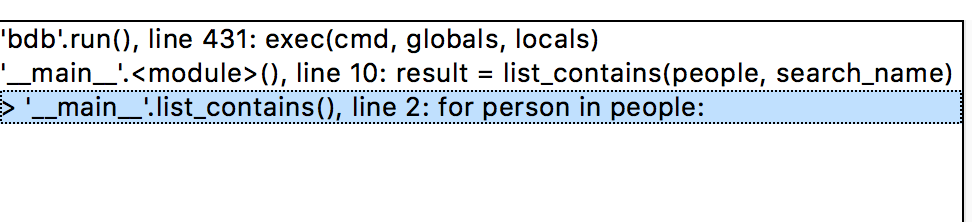

# Intro to debugger

**Duration: 20 mins**

## Learning Objectives

- Understand how to launch the debugger in IDLE
- Understand the the debugger's controls
- Use the debugger to debug a program

# Introduction

IDLE comes with a built-in debugger that helps us to resolve problems in our programs. Let's take a look at it.

> Instructor note: write the following in IDLE and run it / pass it out on Slack. Ask the students _not_ to speak out if they immediately see the error.

> nb: This program will not successfully find entries in `people` unless it is the first entry in the array. It will always `return False` after it checks the first entry, because the indentation level is wrong.

```python
def list_contains(people, search_name):
    for person in people:
        if person == search_name:
            return True
        return False

people = ["Andy", "Barbara", "Charlie", "David", "Elizabeth"]
search_name = "Elizabeth"

result = list_contains(people, search_name)
print(result)
```

## Launching the debugger

If we run the program above, we might not get the result we expected. We can see that the list contains the name `Elizabeth`, but our program is printing False!

Although you might be able to see the problem straight away, let's take a look at how we might use IDLE's debugger to see what's going on.

It looks as if our function is returning `False` when it should be returning `True`. Let's start at the top of the function, and step through the function one line at a time.

### Setting breakpoints

In this case, we should place a breakpoint on the first line of code inside the function - line 2.

Firstly, let's right-click on the line where we want to pause execution of the program.

Click "Set Breakpoint". Breakpoints pause the execution of the program _before_ that particular line executes.

If we execute the program now, nothing has changed. We have to open the debugger before breakpoints take effect.

### Opening the debugger

_Firstly, it's really important to make sure that the shell window is focussed._ If the script window is focussed, you won't see the "Debug" menu that you need.

> Instructor note - click on the script / shell windows alternately and watch the Debug menu appear and disappear.

Select Debug > Debugger. A window should pop up with some controls.

### Using the debugger

Now that the debugger's open, we can try to run our run our program again.

Change the focus to the script window, and run the script again. This time, the program pauses immediately.

To continue executing the program until the next (first) breakpoint, click "Go". We can see the the main window should look like this:



In this case, the debugger is telling us that we've paused at the breakpoint we've set at line 2, which is the result of a function call on line 10.

We can also see all the local variables: `people`, and `search_name` in this case.

Let's look at some of the other controls we have access to:

_Go_: Continues the program until another breakpoint is encountered

_Step_: Continues execution to the next line, then pauses the program

_Over_: If the line contains a function call, execute the function, move onto the next line, then pause the program again

_Out_: Step out of the current function, and pause the program again

_Quit_: Exit the program at the current point

> Task: 5 minutes: Use the debugger to step through the program, and try to figure out where the bug is!

## Conclusion

The debugger is really useful for stepping into our program and helping us to understand what might be going wrong.

Let's continue on to a lab, where we can practice everything we've learned today.
