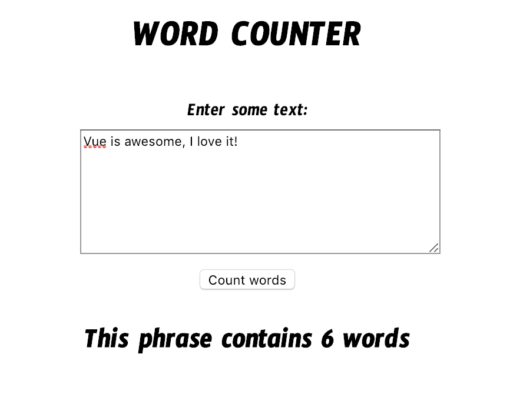

# Homework: Vue Word Counter

## Learning Objectives

- Be able to set up a basic Vue application
- Be able to use forms with `v-model`
- Be able to use `v-on` to manage user events

## Brief

Your task is to create a Word Counter application that allows a user to submit some text, click a button, and have the number of words displayed.

Think about the logic of counting words in a string.

Use Vue and Webpack to build a solution that looks like this:



## Setup

Your folder structure might look like this:

- public
	- css
	- js
	- index.html
- src
	- app.js
	- models
		- WordCounter.js
- .gitignore
- package.json
- webpack.config.js

For your convenience, here is a sample webpack configuration:

```js
const config = {
  entry: `${__dirname}/src/app.js`,
  output: {
    path: `${__dirname}/public/js/`,
    filename: 'bundle.js'
  },
	resolve: {
    alias: {
      'vue$': 'vue/dist/vue.esm.js'
    },
    extensions: ['*', '.js', '.vue', '.json']
  },
  mode: 'development'
};

module.exports = config;
```
